# Doctor Dream - Guardianes del Cuerpo

---

## Diagrama UML del Proyecto

```plantuml
@startuml
skinparam packageStyle rectangle
skinparam backgroundColor #1a1a2e
skinparam componentFontSize 13
skinparam defaultFontName Monospaced
skinparam arrowThickness 2
skinparam classBackgroundColor #16213e
skinparam classBorderColor #0f3460
skinparam classFontColor #e0e0e0
skinparam interfaceBackgroundColor #1a1a3e
skinparam interfaceBorderColor #533483
skinparam enumBackgroundColor #1a3a2e
skinparam enumBorderColor #2d6a4f
skinparam packageBackgroundColor #0d1b2a
skinparam packageBorderColor #1b2838

package "doctordream" {
    class DoctorDream {
        +main(String[] args)
    }
}

package "entidades" {
    interface Combatiente {
        +recibirDanio(int danio)
        +estaVivo(): boolean
        +obtenerVida(): int
    }

    abstract class Entidad {
        #String nombre
        #int vida
        #int vidaMaxima
        +Entidad(String nombre, int vidaMaxima)
        +recibirDanio(int danio)
        +estaVivo(): boolean
        +obtenerVida(): int
        +getVidaMaxima(): int
        +getNombre(): String
    }

    class Jugador {
        -int bonoDanio
        -int escudo
        -int mana
        -Mazo mazo
        +curarse(int vida)
        +agregarMana(int mana)
        +obtenerMana(): int
        +agregarEscudo(int escudo)
        +obtenerEscudo(): int
        +agregarBonoDanio(int cantidad)
        +obtenerBonoDanio(): int
        +usarCarta(Carta, Combatiente)
        +getMazo(): Mazo
    }

    class Enemigo {
        -String tipo
        +atacar(Combatiente objetivo)
        +getTipo(): String
    }

    Combatiente <|.. Entidad
    Entidad <|-- Jugador
    Entidad <|-- Enemigo
    Jugador --> "1" Mazo
}

package "cartas" {
    abstract class Carta {
        #String nombre
        #int costo
        +Carta(String nombre, int costo)
        +{abstract} usar(Jugador usuario, Combatiente objetivo)
        +getNombre(): String
    }

    class CartaAtaque {
        -int danio
        +usar(Jugador, Combatiente)
    }

    class CartaDefensa {
        -int escudo
        +usar(Jugador, Combatiente)
    }

    class CartaEfecto {
        -int bonoDanio
        +usar(Jugador, Combatiente)
    }

    class CartaCuracion {
        -int curacion
        +usar(Jugador, Combatiente)
    }

    Carta <|-- CartaAtaque
    Carta <|-- CartaDefensa
    Carta <|-- CartaEfecto
    Carta <|-- CartaCuracion
}

package "mazo" {
    class Mazo {
        -List<Carta> pilaRobo
        -Stack<Carta> pilaDescarte
        -Queue<Carta> mano
        +barajar()
        +robar(): Carta
        +descartar(Carta)
        +getPilaRobo(): List<Carta>
        +getPilaDescarte(): Stack<Carta>
        +getMano(): Queue<Carta>
    }
    Mazo --> "*" Carta
}

package "combate" {
    class GestorCombate {
        -Combatiente jugador
        -List<Enemigo> enemigos
        -boolean turnoJugador
        -boolean terminado
        +jugarCarta(Jugador, Carta, Combatiente)
        +ejecutarAtaqueEnemigo(Enemigo): int
        +pasarTurnoJugador()
        +esTurnoJugador(): boolean
        +estaTerminado(): boolean
        +getJugador(): Combatiente
        +getEnemigos(): List<Enemigo>
    }
    GestorCombate --> "*" Enemigo
    GestorCombate --> "1" Combatiente
    GestorCombate --> Carta
}

package "juego.eventbus" {
    enum Evento {
        INICIAR_COMBATE
        CARTA_USADA
        TURNO_JUGADOR
        TURNO_ENEMIGO
        ENEMIGO_ATACO
        VIDA_ACTUALIZADA
        COMBATE_TERMINADO
        MOSTRAR_MENU
        MOSTRAR_COMBATE
        ENEMIGO_SELECCIONADO
    }

    class EventBus {
        -Map<Evento, List<Consumer>> suscriptores
        +getInstancia(): EventBus
        +suscribir(Evento, Consumer)
        +desuscribir(Evento, Consumer)
        +publicar(Evento, Object)
        +publicar(Evento)
    }
    EventBus --> "*" Evento
}

package "juego.controlador" {
    class ControladorMenu {
        +mostrarMenu()
        +iniciarCombate()
    }

    class ControladorCombate {
        -GestorCombate gestor
        -Jugador jugador
        -List<Enemigo> enemigos
        +iniciarCombate()
        +usarCarta(Carta, Combatiente)
        +getGestor(): GestorCombate
        +getJugador(): Jugador
        +getEnemigos(): List<Enemigo>
    }
    ControladorMenu --> ControladorCombate
    ControladorCombate --> GestorCombate
    ControladorCombate --> EventBus
}

package "juego.vista" {
    class VentanaPrincipal {
        -CardLayout cardLayout
        -JPanel panelPrincipal
        -PanelMenu panelMenu
        +VentanaPrincipal(ControladorMenu)
    }

    class PanelMenu {
        -BufferedImage fondo
        +PanelMenu(ControladorMenu)
    }

    class PanelCombate {
        -JLabel lblVidaJugador
        -JLabel lblEscudo
        -JLabel lblBono
        -JLabel lblTurno
        -JPanel panelMano
        -JTextArea areaLog
        -PanelSpritesCentro panelSprites
        -List<Runnable> limpiezas
        +PanelCombate(ControladorCombate)
    }
    VentanaPrincipal --> PanelMenu
    VentanaPrincipal --> PanelCombate
    PanelCombate --> PanelSpritesCentro
    PanelCombate --> EventBus
    PanelCombate --> ControladorCombate
}

package "juego.vista.sprite" {
    class Animacion {
        -BufferedImage[] frames
        -int frameActual
        -boolean activa
        -boolean looping
        +reproducirUnaVez()
        +reproducirEnBucle()
        +detener()
        +actualizar(): boolean
        +getFrame(): BufferedImage
        +setFrames(BufferedImage[])
        +isActiva(): boolean
    }

    class GestorRecursos {
        -Map<String, BufferedImage[]> animaciones
        -Map<String, BufferedImage> imagenes
        +getInstancia(): GestorRecursos
        +getAnimacion(String key): BufferedImage[]
        +getImagen(String key): BufferedImage
        +getAnimacionKeyPorTipoEnemigo(String tipo): String
    }

    class SpriteSheet {
        +{static} dibujarJugador(Graphics2D, int x, int y, int s)
        +{static} dibujarEnemigo(Graphics2D, int x, int y, int s)
        +{static} dibujarEsbirro(Graphics2D, int x, int y, int s)
        +{static} dibujarCarta(Graphics2D, int x, int y, int w, int h, Carta)
    }

    class PanelSpritesCentro {
        -Animacion animJugador
        -Animacion[] animEnemigos
        -Enemigo[] enemigosData
        -boolean[] enemigosMuertos
        -int enemigoSeleccionado
        -String mensajeCentral
        -BufferedImage mapaFondo
        -boolean jugadorMuerto
        +setAnimacionJugador(String, boolean)
        +setAnimacionEnemigoPorIndice(int, String, boolean)
        +setAnimacionJugadorMuerte()
        +setAnimacionEnemigoMuerteTodos()
        +reiniciarEnemigos()
        +getEnemigoSeleccionado(): Enemigo
        +seleccionarPrimerEnemigoVivo()
        +setMensajeCentral(String)
        +actualizarHPs()
    }
    PanelSpritesCentro --> GestorRecursos
    PanelSpritesCentro --> "1" Animacion : jugador
    PanelSpritesCentro --> "*" Animacion : enemigos
    PanelSpritesCentro --> ControladorCombate
}

@enduml
```



---

## RESUMEN DEL PROYECTO

### ¿Qué es Doctor Dream?

**Doctor Dream - Guardianes del Cuerpo** es un videojuego de **combate por turnos con cartas** (turn-based card battler) desarrollado en **Java puro con Swing**. No usa ningún motor ni framework externo — es código 100% artesanal.

### Concepto

El jugador controla al **Doctor Dream**, un médico que lucha contra enfermedades personificadas como enemigos. Usa cartas que representan tratamientos médicos (Paracetamol, Vacuna, Sopa de Pollo, etc.) para derrotar a 4 enemigos simultáneamente:

- **BOSS** (100 HP) — el jefe final
- **Moco Mutado** (40 HP) — esbirro
- **Moquillo** (30 HP) — esbirro
- **Virus** (20 HP) — esbirro

### Arquitectura del Proyecto

El proyecto sigue una arquitectura en capas con **patrón MVC** (Modelo-Vista-Controlador) y un sistema de eventos desacoplado:

```

┌─────────────────────────────────────────────────┐
│                    VISTA (Swing)                  │
│  VentanaPrincipal, PanelMenu, PanelCombate,       │
│  PanelSpritesCentro                               │
└──────────────────┬──────────────────────────────┘
                   │ EventBus (pub/sub)
┌──────────────────▼──────────────────────────────┐
│                 CONTROLADOR                      │
│  ControladorMenu, ControladorCombate             │
└──────────────────┬──────────────────────────────┘
                   │
┌──────────────────▼──────────────────────────────┐
│                MODELO (negocio)                   │
│  Entidad, Jugador, Enemigo, Carta*, Mazo,        │
│  GestorCombate                                   │
└─────────────────────────────────────────────────┘

```

### Estructura de Paquetes

| Paquete | Responsabilidad | Clases principales |
|---------|----------------|-------------------|
| `doctordream` | Entry point | `DoctorDream` (main) |
| `entidades` | Modelo del dominio | `Combatiente`, `Entidad`, `Jugador`, `Enemigo` |
| `cartas` | Sistema de cartas | `Carta`, `CartaAtaque`, `CartaDefensa`, `CartaEfecto`, `CartaCuracion` |
| `combate` | Lógica de combate | `GestorCombate` |
| `mazo` | Gestión de mazo/robo/descarte | `Mazo` |
| `juego.controlador` | Controladores MVC | `ControladorMenu`, `ControladorCombate` |
| `juego.vista` | Vistas Swing | `VentanaPrincipal`, `PanelMenu`, `PanelCombate` |
| `juego.vista.sprite` | Animaciones y sprites | `Animacion`, `SpriteSheet`, `GestorRecursos`, `PanelSpritesCentro` |
| `juego.eventbus` | Sistema de eventos | `EventBus` (singleton), `Evento` (enum) |

### Patrones de Diseño Implementados

1. **MVC (Modelo-Vista-Controlador)**
   - **Modelo**: `Entidad`, `Jugador`, `Enemigo`, `Carta`, `GestorCombate`, `Mazo`
   - **Vista**: `PanelMenu`, `PanelCombate`, `PanelSpritesCentro`
   - **Controlador**: `ControladorMenu`, `ControladorCombate`

2. **Observer (pub/sub) — EventBus**
   - `EventBus` es un singleton que desacopla la vista de la lógica
   - Los controladores publican eventos (`CARTA_USADA`, `TURNO_ENEMIGO`, etc.)
   - Las vistas se suscriben y reaccionan (actualizar HUD, reproducir animaciones)
   - Esto permite cambiar la UI sin tocar la lógica de negocio

3. **Strategy — Cartas**
   - `Carta` es una clase abstracta con el método `usar(Jugador, Combatiente)`
   - Cada tipo de carta implementa su propia estrategia:
     - `CartaAtaque` → daña al objetivo
     - `CartaDefensa` → agrega escudo al jugador
     - `CartaEfecto` → aumenta el daño del jugador
     - `CartaCuracion` → cura al jugador

4. **Template Method — Entidad**
   - `Entidad` define el esqueleto (vida, daño, muerte)
   - `Jugador` y `Enemigo` extienden con comportamiento específico

5. **Singleton — GestorRecursos y EventBus**
   - `GestorRecursos.getInstancia()` — carga única de sprites e imágenes
   - `EventBus.getInstancia()` — bus de eventos global

6. **State — Animacion**
   - La animación tiene estados: activa/inactiva, looping/one-shot
   - `actualizar()` avanza el frame y notifica cuando termina

### Flujo del Combate

```
1. JUGADOR juega una carta
   ↓
2. CARTA_USADA → animación del doctor (ataque/defensa/boost) ~900ms
   ↓
3. Por cada ENEMIGO VIVO (en orden):
   a. TURNO_ENEMIGO → animación de daño al doctor
   b. Enemigo ataca (daño 5-10 aleatorio)
   c. ENEMIGO_ATACO → log en bitácora
   d. Pausa de 500ms entre ataques
   ↓
4. TURNO_JUGADOR → vuelve a idle, roba carta, activa botones
```

### Mecánicas del Juego

- **Turnos**: El jugador siempre juega primero, luego atacan todos los enemigos uno por uno
- **Selección de objetivo**: Click en un enemigo para seleccionarlo (borde dorado), luego click en carta para atacarlo
- **Mazo**: 6 cartas, se barajan, se roban 4 al inicio, se descartan tras usar
- **Victoria**: Todos los enemigos derrotados
- **Derrota**: El jugador se queda sin vida
- **Bono de daño**: Se acumula con cartas de Efecto, se aplica al siguiente ataque
- **Escudo**: Se acumula con cartas de Defensa (pendiente de implementar reducción de daño)

### Animaciones Disponibles

| Personaje | Animaciones |
|-----------|-------------|
| Doctor | idle (4 frames), daño (3), muerte (9), ataque (7), defensa (7), boost (7) |
| BOSS | idle (9 frames) |
| Moco Mutado | idle (5 frames) |
| Moquillo | idle (5 frames) |
| Virus | idle (4 frames) |

### Cómo se ve la pantalla de combate

```
┌──────────────────────────────────────────────────────┐
│ [Doctor Dream]  [🛡️ Escudo] [⚔️ Bono]  [🎲 Tu turno] │  ← HUD
├──────────────────────────────────────────────────────┤
│                                                      │
│           [Doctor]           VS       [BOSS]         │
│            (sprite)                  [Moco] [Moquillo]│
│            [████ HP]                [Virus]          │
│                                                      │
│                                      ← mensaje central
├──────────────────────────────────┬───────────────────┤
│ [Paracetamol] [Vacuna] [Sopa]... │ 📋 Bitácora       │  ← mano y log
└──────────────────────────────────┴───────────────────┘
```

### Tecnologías Utilizadas

- **Lenguaje**: Java 17+
- **UI**: Swing (JFrame, JPanel, CardLayout, Timer)
- **Assets**: PNGs animados + fondo JPG + sprites procedurales (SpriteSheet)
- **Build**: Apache Ant (NetBeans)
- **Sin dependencias externas**: zero librerías de terceros

### Puntos de Extensión

1. **Nuevos tipos de carta**: Crear clase que extienda `Carta` e implementar `usar()`
2. **Nuevos enemigos**: Crear instancia de `Enemigo` con tipo y agregar animación en `GestorRecursos`
3. **Nuevos efectos**: Agregar estado al jugador (ej. veneno, regeneración)
4. **Mecánica de escudo**: Implementar reducción de daño en `Entidad.recibirDanio()` usando `getEscudo()`
5. **Sonido**: Agregar reproducción de audio en eventos clave

### Glosario rápido para la expo

| Término | Significado |
|---------|-------------|
| **Singleton** | Patrón que asegura una sola instancia global (EventBus, GestorRecursos) |
| **EventBus** | Sistema pub/sub para comunicación desacoplada entre componentes |
| **CardLayout** | Layout de Swing que permite cambiar entre pantallas (menú ↔ combate) |
| **One-shot** | Animación que se reproduce una vez y luego vuelve a idle |
| **SpriteSheet** | Dibujos procedurales en código (fallback cuando no hay PNGs) |
| **Timer Swing** | Temporizador de 120ms que actualiza frames de animación |

---
