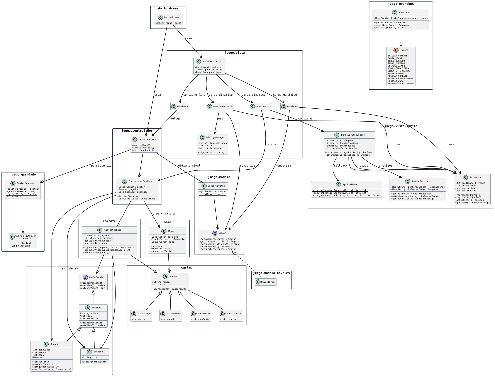

# Diagrama UML - DoctorDream: Guardianes del Cuerpo

```plantuml
@startuml
skinparam classAttributeIconSize 0
skinparam packageStyle rectangle
skinparam defaultFontName Monospaced
skinparam arrowThickness 2
skinparam classBorderColor #0f3460
skinparam interfaceBorderColor #533483
skinparam enumBorderColor #2d6a4f
skinparam packageBorderColor #1b2838
skinparam classFontSize 12
skinparam classAttributeFontSize 10

hide empty members

' ============================================================================
' NOTA GLOBAL - PATRONES Y FLUJO
' ============================================================================


' ============================================================================
' PAQUETE: doctordream (ENTRY POINT)
' ============================================================================
package "doctordream" as P_MAIN {
  class DoctorDream {
    +{static} main(String[] args)
  }

}

' ============================================================================
' PAQUETE: entidades (MODELO)
' ============================================================================
package "entidades" as P_ENT {
  interface Combatiente {
    +recibirDanio(int)
    +estaVivo(): boolean
    +obtenerVida(): int
  }

  abstract class Entidad {
    #String nombre
    #int vida
    #int vidaMaxima
    +recibirDanio(int)
    +estaVivo(): boolean
  }

  class Jugador {
    -int bonoDanio
    -int escudo
    -int mana
    -Mazo mazo
    +curarse(int)
    +agregarEscudo(int)
    +agregarBonoDanio(int)
    +usarCarta(Carta, Combatiente)
  }

  class Enemigo {
    -String tipo
    +atacar(Combatiente)
  }

  Combatiente <|.. Entidad
  Entidad <|-- Jugador
  Entidad <|-- Enemigo
}

' ============================================================================
' PAQUETE: cartas (MODELO - STRATEGY)
' ============================================================================
package "cartas" as P_CARTAS {
  abstract class Carta {
    #String nombre
    #int costo
    +{abstract} usar(Jugador, Combatiente)
  }

  class CartaAtaque {
    -int danio
  }

  class CartaDefensa {
    -int escudo
  }

  class CartaEfecto {
    -int bonoDanio
  }

  class CartaCuracion {
    -int curacion
  }

  Carta <|-- CartaAtaque
  Carta <|-- CartaDefensa
  Carta <|-- CartaEfecto
  Carta <|-- CartaCuracion
}

' ============================================================================
' PAQUETE: mazo (MODELO)
' ============================================================================
package "mazo" as P_MAZO {
  class Mazo {
    -List<Carta> pilaRobo
    -Stack<Carta> pilaDescarte
    -Queue<Carta> mano
    +barajar()
    +robar(): Carta
    +descartar(Carta)
  }
  Mazo --> "*" Carta
}

' ============================================================================
' PAQUETE: combate (MODELO)
' ============================================================================
package "combate" as P_COMB {
  class GestorCombate {
    -Combatiente jugador
    -List<Enemigo> enemigos
    -boolean turnoJugador
    -boolean terminado
    +jugarCarta(Jugador, Carta, Combatiente)
    +ejecutarAtaqueEnemigo(Enemigo): int
    +pasarTurnoJugador()
  }
  GestorCombate --> Combatiente
  GestorCombate --> "*" Enemigo
  GestorCombate --> Carta
}

' ============================================================================
' PAQUETE: juego.eventbus (INFRAESTRUCTURA - OBSERVER)
' ============================================================================
package "juego.eventbus" as P_EB {
  enum Evento {
    INICIAR_COMBATE
    CARTA_USADA
    TURNO_JUGADOR
    TURNO_ENEMIGO
    ENEMIGO_ATACO
    VIDA_ACTUALIZADA
    COMBATE_TERMINADO
    MOSTRAR_MENU
    MOSTRAR_COMBATE
    MOSTRAR_CONSULTORIO
    MOSTRAR_CASA
    ENEMIGO_SELECCIONADO
  }

  class EventBus {
    -Map<Evento, List<Consumer>> suscriptores
    +{static} getInstancia(): EventBus
    +suscribir(Evento, Consumer)
    +publicar(Evento, Object)
  }
  EventBus --> "*" Evento
}

' ============================================================================
' PAQUETE: juego.controlador (ORQUESTADORES)
' ============================================================================
package "juego.controlador" as P_CTRL {
  class ControladorMenu {
    +mostrarMenu()
    +iniciarPartida()
    +continuarPartida()
  }
  class ControladorCombate {
    -GestorCombate gestor
    -Jugador jugador
    -List<Enemigo> enemigos
    +iniciarCombate()
    +usarCarta(Carta, Combatiente)
  }
  ControladorMenu --> ControladorCombate
  ControladorCombate --> GestorCombate
  ControladorCombate --> Jugador
  ControladorCombate --> "*" Enemigo
}

' ============================================================================
' PAQUETE: juego.modelo (SISTEMA DE NIVELES)
' ============================================================================
package "juego.modelo" as P_MOD {
  interface Nivel {
    +getNombrePaciente(): String
    +getDialogos(): List<String>
    +getFondoConsultorio(): String
    +getFondoCasa(): String
    +getSpritePaciente(): String
  }

  class GestorNiveles {
    +{static} getNivel(int): Nivel
    +{static} totalNiveles(): int
  }
  GestorNiveles --> Nivel
}

package "juego.modelo.niveles" as P_NIV {
  class Nivel1Gripe

  Nivel <|.. Nivel1Gripe
}

' ============================================================================
' PAQUETE: juego.guardado (PERSISTENCIA)
' ============================================================================
package "juego.guardado" as P_SAVE {
  class DatosPartida <<Serializable>> {
    -int nivelActual
    -long timestamp
  }

  class GestorGuardado {
    +{static} existePartida(): boolean
    +{static} guardar(DatosPartida)
    +{static} cargar(): DatosPartida
    +{static} eliminar()
  }
  GestorGuardado --> DatosPartida
}

' ============================================================================
' PAQUETE: juego.vista (UI SWING)
' ============================================================================
package "juego.vista" as P_VIEW {
  class VentanaPrincipal {
    -CardLayout cardLayout
    -JPanel panelPrincipal
    -PanelMenu panelMenu
  }
  class PanelMenu
  class PanelConsultorio
  class PanelCasa
  class PanelCombate
  class DialogoManager {
    -List<String> dialogos
    -int indice
    -boolean terminado
    +siguiente(): String
  }
  VentanaPrincipal --> PanelMenu : contiene fijo
  VentanaPrincipal --> PanelConsultorio : carga dinámico
  VentanaPrincipal --> PanelCasa : carga dinámico
  VentanaPrincipal --> PanelCombate : carga dinámico
  PanelConsultorio --> DialogoManager : usa
}
' ============================================================================
' PAQUETE: juego.vista.sprite (RENDER)
' ============================================================================
package "juego.vista.sprite" as P_SPR {
  class Animacion {
    -BufferedImage[] frames
    -int frameActual
    -boolean activa
    -boolean looping
    +reproducirUnaVez()
    +reproducirEnBucle()
    +actualizar(): boolean
    +getFrame(): BufferedImage
  }
  class SpriteSheet {
    +{static} dibujarJugador(Graphics2D, int, int, int)
    +{static} dibujarEnemigo(Graphics2D, int, int, int)
    +{static} dibujarCarta(Graphics2D, int, int, int, int, Carta)
  }
  class GestorRecursos {
    -Map<String, BufferedImage[]> animaciones
    -Map<String, BufferedImage> imagenes
    +{static} getInstancia(): GestorRecursos
    +getAnimacion(String): BufferedImage[]
    +getImagen(String): BufferedImage
  }
  class PanelSpritesCentro {
    -Animacion animJugador
    -Animacion[] animEnemigos
    -Enemigo[] enemigosData
    -int enemigoSeleccionado
    +setAnimacionJugador(String, boolean)
    +getEnemigoSeleccionado(): Enemigo
  }
  PanelSpritesCentro --> "1" Animacion : jugador
  PanelSpritesCentro --> "*" Animacion : enemigos
  PanelSpritesCentro --> GestorRecursos
  PanelSpritesCentro --> SpriteSheet : fallback
}

' ============================================================================
' RELACIONES DE ALTO NIVEL (ARQUITECTURA MVC)
' ============================================================================

' --- Entry Point ---
DoctorDream --> ControladorMenu : crea
DoctorDream --> VentanaPrincipal : crea

' --- Vista → Controlador (delegación) ---
PanelMenu --> ControladorMenu : delega
PanelCombate --> ControladorCombate : delega

' --- Vista → Sprite ---
PanelCombate --> PanelSpritesCentro : contiene
PanelConsultorio --> Animacion : usa
PanelCasa --> Animacion : usa

' --- Vista → Modelo ---
PanelConsultorio --> Nivel : renderiza
PanelCasa --> Nivel : renderiza

' --- Controlador → Modelo ---
ControladorMenu --> GestorNiveles : obtiene nivel
ControladorMenu --> GestorGuardado : persistencia

' --- Controlador → Servicios/Infra ---
ControladorCombate --> Mazo : crea y maneja


@enduml
```
