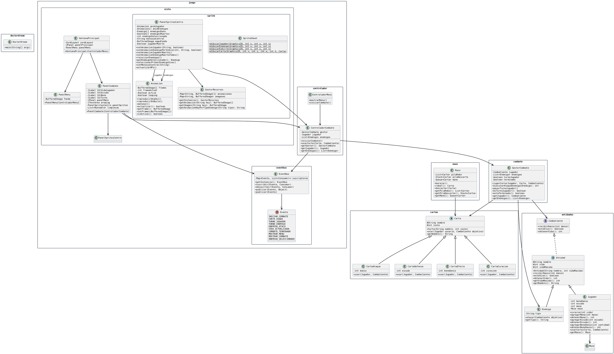

```plantuml
@startuml
skinparam classAttributeIconSize 0
skinparam packageStyle rectangle
skinparam componentFontSize 13
skinparam defaultFontName Monospaced
skinparam arrowThickness 2
skinparam classBorderColor #0f3460
skinparam interfaceBorderColor #533483
skinparam enumBorderColor #2d6a4f
skinparam packageBorderColor #1b2838

package "doctordream" {
    class DoctorDream {
        +main(String[] args)
    }
}

package "entidades" {
    interface Combatiente {
        +recibirDanio(int danio)
        +estaVivo(): boolean
        +obtenerVida(): int
    }

    abstract class Entidad {
        #String nombre
        #int vida
        #int vidaMaxima
        +Entidad(String nombre, int vidaMaxima)
        +recibirDanio(int danio)
        +estaVivo(): boolean
        +obtenerVida(): int
        +getVidaMaxima(): int
        +getNombre(): String
    }

    class Jugador {
        -int bonoDanio
        -int escudo
        -int mana
        -Mazo mazo
        +curarse(int vida)
        +agregarMana(int mana)
        +obtenerMana(): int
        +agregarEscudo(int escudo)
        +obtenerEscudo(): int
        +agregarBonoDanio(int cantidad)
        +obtenerBonoDanio(): int
        +usarCarta(Carta, Combatiente)
        +getMazo(): Mazo
    }

    class Enemigo {
        -String tipo
        +atacar(Combatiente objetivo)
        +getTipo(): String
    }

    Combatiente <|.. Entidad
    Entidad <|-- Jugador
    Entidad <|-- Enemigo
    Jugador --> "1" Mazo
}

package "cartas" {
    abstract class Carta {
        #String nombre
        #int costo
        +Carta(String nombre, int costo)
        +{abstract} usar(Jugador usuario, Combatiente objetivo)
        +getNombre(): String
    }

    class CartaAtaque {
        -int danio
        +usar(Jugador, Combatiente)
    }

    class CartaDefensa {
        -int escudo
        +usar(Jugador, Combatiente)
    }

    class CartaEfecto {
        -int bonoDanio
        +usar(Jugador, Combatiente)
    }

    class CartaCuracion {
        -int curacion
        +usar(Jugador, Combatiente)
    }

    Carta <|-- CartaAtaque
    Carta <|-- CartaDefensa
    Carta <|-- CartaEfecto
    Carta <|-- CartaCuracion
}

package "mazo" {
    class Mazo {
        -List<Carta> pilaRobo
        -Stack<Carta> pilaDescarte
        -Queue<Carta> mano
        +barajar()
        +robar(): Carta
        +descartar(Carta)
        +getPilaRobo(): List<Carta>
        +getPilaDescarte(): Stack<Carta>
        +getMano(): Queue<Carta>
    }
    Mazo --> "*" Carta
}

package "combate" {
    class GestorCombate {
        -Combatiente jugador
        -List<Enemigo> enemigos
        -boolean turnoJugador
        -boolean terminado
        +jugarCarta(Jugador, Carta, Combatiente)
        +ejecutarAtaqueEnemigo(Enemigo): int
        +pasarTurnoJugador()
        +esTurnoJugador(): boolean
        +estaTerminado(): boolean
        +getJugador(): Combatiente
        +getEnemigos(): List<Enemigo>
    }
    GestorCombate --> "*" Enemigo
    GestorCombate --> "1" Combatiente
    GestorCombate --> Carta
}

package "juego.eventbus" {
    enum Evento {
        INICIAR_COMBATE
        CARTA_USADA
        TURNO_JUGADOR
        TURNO_ENEMIGO
        ENEMIGO_ATACO
        VIDA_ACTUALIZADA
        COMBATE_TERMINADO
        MOSTRAR_MENU
        MOSTRAR_COMBATE
        ENEMIGO_SELECCIONADO
    }

    class EventBus {
        -Map<Evento, List<Consumer>> suscriptores
        +getInstancia(): EventBus
        +suscribir(Evento, Consumer)
        +desuscribir(Evento, Consumer)
        +publicar(Evento, Object)
        +publicar(Evento)
    }
    EventBus --> "*" Evento
}

package "juego.controlador" {
    class ControladorMenu {
        +mostrarMenu()
        +iniciarCombate()
    }

    class ControladorCombate {
        -GestorCombate gestor
        -Jugador jugador
        -List<Enemigo> enemigos
        +iniciarCombate()
        +usarCarta(Carta, Combatiente)
        +getGestor(): GestorCombate
        +getJugador(): Jugador
        +getEnemigos(): List<Enemigo>
    }
    ControladorMenu --> ControladorCombate
    ControladorCombate --> GestorCombate
    ControladorCombate --> EventBus
}

package "juego.vista" {
    class VentanaPrincipal {
        -CardLayout cardLayout
        -JPanel panelPrincipal
        -PanelMenu panelMenu
        +VentanaPrincipal(ControladorMenu)
    }

    class PanelMenu {
        -BufferedImage fondo
        +PanelMenu(ControladorMenu)
    }

    class PanelCombate {
        -JLabel lblVidaJugador
        -JLabel lblEscudo
        -JLabel lblBono
        -JLabel lblTurno
        -JPanel panelMano
        -JTextArea areaLog
        -PanelSpritesCentro panelSprites
        -List<Runnable> limpiezas
        +PanelCombate(ControladorCombate)
    }
    VentanaPrincipal --> PanelMenu
    VentanaPrincipal --> PanelCombate
    PanelCombate --> PanelSpritesCentro
    PanelCombate --> EventBus
    PanelCombate --> ControladorCombate
}

package "juego.vista.sprite" {
    class Animacion {
        -BufferedImage[] frames
        -int frameActual
        -boolean activa
        -boolean looping
        +reproducirUnaVez()
        +reproducirEnBucle()
        +detener()
        +actualizar(): boolean
        +getFrame(): BufferedImage
        +setFrames(BufferedImage[])
        +isActiva(): boolean
    }

    class GestorRecursos {
        -Map<String, BufferedImage[]> animaciones
        -Map<String, BufferedImage> imagenes
        +getInstancia(): GestorRecursos
        +getAnimacion(String key): BufferedImage[]
        +getImagen(String key): BufferedImage
        +getAnimacionKeyPorTipoEnemigo(String tipo): String
    }

    class SpriteSheet {
        +{static} dibujarJugador(Graphics2D, int x, int y, int s)
        +{static} dibujarEnemigo(Graphics2D, int x, int y, int s)
        +{static} dibujarEsbirro(Graphics2D, int x, int y, int s)
        +{static} dibujarCarta(Graphics2D, int x, int y, int w, int h, Carta)
    }

    class PanelSpritesCentro {
        -Animacion animJugador
        -Animacion[] animEnemigos
        -Enemigo[] enemigosData
        -boolean[] enemigosMuertos
        -int enemigoSeleccionado
        -String mensajeCentral
        -BufferedImage mapaFondo
        -boolean jugadorMuerto
        +setAnimacionJugador(String, boolean)
        +setAnimacionEnemigoPorIndice(int, String, boolean)
        +setAnimacionJugadorMuerte()
        +setAnimacionEnemigoMuerteTodos()
        +reiniciarEnemigos()
        +getEnemigoSeleccionado(): Enemigo
        +seleccionarPrimerEnemigoVivo()
        +setMensajeCentral(String)
        +actualizarHPs()
    }
    PanelSpritesCentro --> GestorRecursos
    PanelSpritesCentro --> "1" Animacion : jugador
    PanelSpritesCentro --> "*" Animacion : enemigos
    PanelSpritesCentro --> ControladorCombate
}

@enduml
```